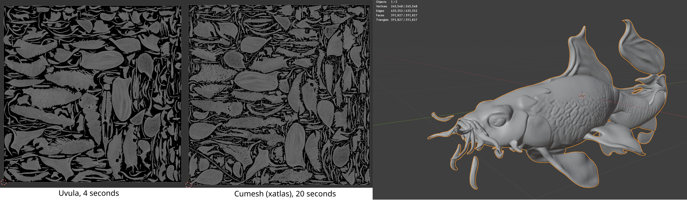

## libuvula-fork

This library is a fork of the [Uvula](https://github.com/Ultimaker/libUvula?tab=LGPL-3.0-1-ov-file) library developped by Ultimaker company.
It is a UV-unwrapping package that works fast for small meshes as well as for quite big ones (over 1 000 000 faces).
It provides grouped and non-overlapping patches of projected faces on a texture.
This implementation slightly differs from the original one. 

### 🛠️ Hardware Requirements:
This project can be run on any machine as it does not rely on GPU.

### 🛠️ Software Requirements:
You will only need pre-installed **mini-conda3**. The provided script will install all essential packages afterwards.

### 🚀 How to install / uninstall project:
- Install the project using bash script "setup_env.sh" (tt will also build python wheels for the current project):
```console
bash setup_env.sh
```
- Uninstall project using the bash script "cleanup_env.sh":
```console
bash cleanup_env.sh
```
The wheel file will be generated in "wheel" folder.

### 🚀 How to run project:
The python bindings expose the following function:

```python
def unwrap(vertices: np.ndarray, faces: np.ndarray):
    """
    Function for UV unwrapping of the mesh
    vertices: np.ndarray with mesh vertices
    faces: np.ndarray with  mesh faces
    
    Returns:
    uvs: np.ndarray with generated uvs
    vertices: np.ndarray with vertices after uv unwrapping
    faces: np.ndarray with face indices after uv unwrapping
    uv_texture_width: int, size of the uv map, width
    uv_texture_height: int, size of the uv map, height
    """
    pass
```

To use this function in python just do the following:
```python
from pathlib import Path

import pyuvula
from pyuvula import load_mesh, assemble_textured_mesh

mesh = load_mesh("/model.glb") # load mesh as trimesh object;
mesh.merge_vertices()          # important step for removing duplicated vertices;
out_uvs, out_vertices, out_faces, uv_texture_width, uv_texture_height = pyuvula.unwrap(np.array(mesh.vertices), np.array(mesh.faces))

unwrapped_mesh = assemble_textured_mesh(out_vertices, out_faces, out_uvs)
```
We also provide a simple tool for uv unwrapping of the meshes **uv_unwrapping_tool.py**.
It is a simple console based tool:
```commandline
python uv_unwrapping_tool.py --mesh_folder_path "/meshes_folder" --output_folder "/ununwrapped"
```

### 🚀 Uvula vs [Cumesh (xatlas)](https://github.com/JeffreyXiang/CuMesh)
Most of the time Uvula will outperform xatlas by x2-x10 times with better uv packing and uv islands size.
Below you can find an example of the uv unwrapped fish with relatively low polygon count.


And here there is an example of uv-unwrapped high polygonal robot head.


### ⚖️ License

This model and code are released under the **[GNU LGPL License](LICENSE)** that allows for commercial use.